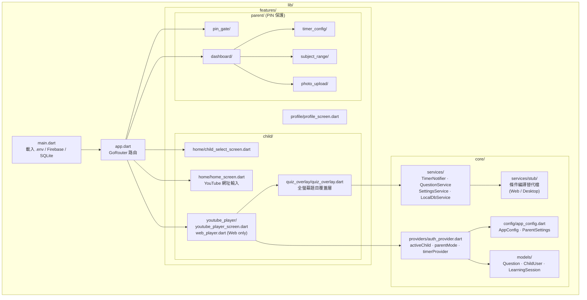
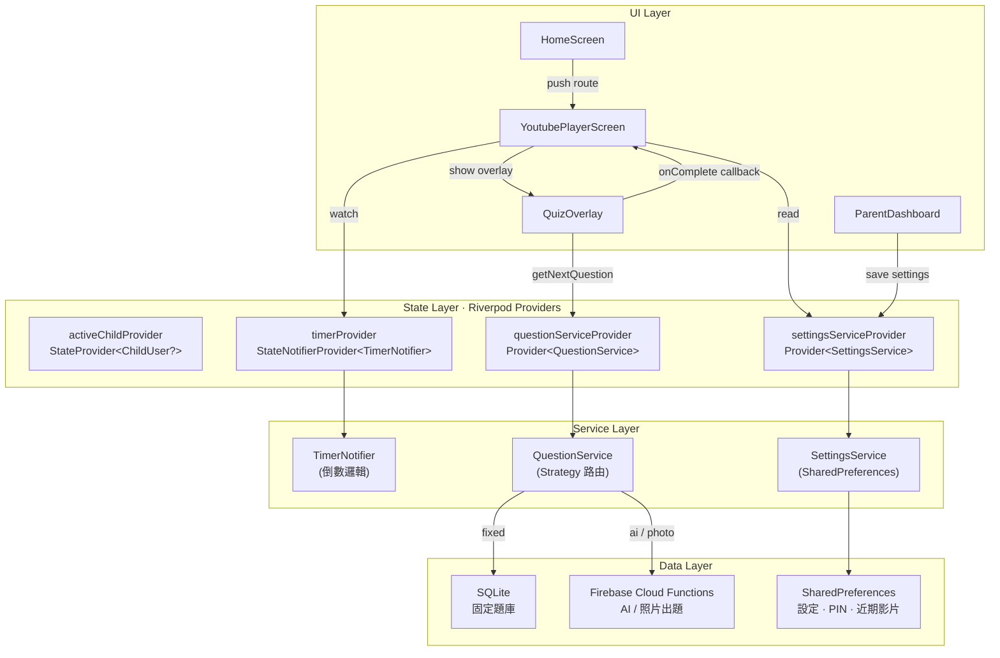
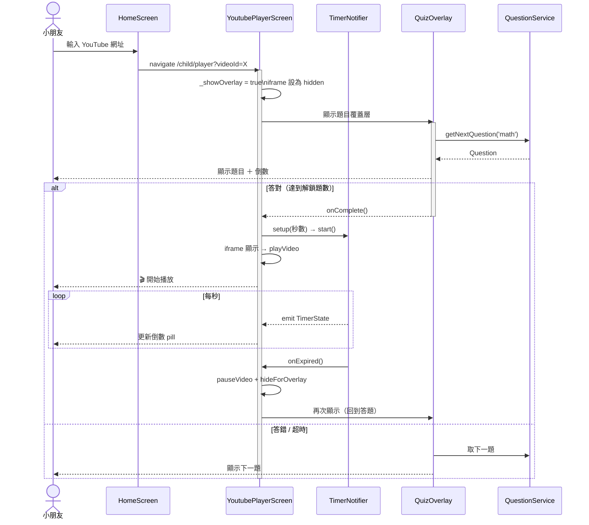

# 國小學習遊戲

讓孩子在看 YouTube 的同時學習課程。
孩子看 YouTube 30 分鐘後，畫面強制被題目覆蓋，答對才能繼續看。

## 功能

- 🎬 YouTube 嵌入播放（App 內，非外部）
- ⏱ 可設定的計時器（預設 30 分鐘）
- 📝 全螢幕題目覆蓋層（無法關閉，答對才解除）
- 🔒 家長 PIN 保護設定（孩子無法存取設定）
- 📚 支援數學 + 國文，1-6 年級
- 🤖 AI 動態出題（Claude API）
- 📷 照片出題（上傳教材照片）
- 📊 學習記錄統計

## 技術棧

| 層級 | 技術 |
|------|------|
| App | Flutter (Android / iOS / Windows / macOS) |
| 後端 | Supabase (PostgreSQL + Edge Functions) |
| AI 出題 | Claude API (claude-haiku-4-5) |
| 狀態管理 | Riverpod |
| 路由 | go_router |

## 快速開始

### 前置需求

- [Flutter SDK](https://flutter.dev) >= 3.0
- [Supabase](https://supabase.com) 帳號
- [Claude API Key](https://console.anthropic.com)
- Node.js >= 18（題庫生成工具）

### 1. 設定 Supabase

```bash
# 安裝 Supabase CLI
npm install -g @supabase/cli

# 初始化（或連線到已有專案）
supabase link --project-ref YOUR_PROJECT_REF

# 執行資料庫 migration
supabase db push

# 部署 Edge Functions
supabase functions deploy generate-question
supabase functions deploy generate-from-photo

# 設定 Edge Function 環境變數
supabase secrets set CLAUDE_API_KEY=your-claude-api-key
```

### 2. 生成題庫（Phase 1）

```bash
cd tools/question_generator
npm install

# 設定 Claude API Key
export CLAUDE_API_KEY=your-api-key

# 生成 2 年級數學題庫
npx ts-node generator.ts --subject=math --grade=2 --output=json

# 輸出至 output/questions.json，複製到 Flutter assets
cp output/questions.json ../../assets/questions/questions.json
```

### 3. 執行 Flutter App

```bash
# 安裝依賴
flutter pub get

# 執行（需傳入 Supabase 設定）
flutter run \
  --dart-define=SUPABASE_URL=https://your-project.supabase.co \
  --dart-define=SUPABASE_ANON_KEY=your-anon-key
```

## 專案結構

```
SchoolExam/
├── lib/
│   ├── main.dart                    # 程式入口
│   ├── app.dart                     # 路由設定
│   ├── core/
│   │   ├── config/app_config.dart   # 設定常數
│   │   ├── models/                  # 資料模型
│   │   ├── providers/               # Riverpod 狀態
│   │   └── services/                # 商業邏輯服務
│   └── features/
│       ├── child/                   # 孩子端（孩子可見）
│       │   ├── home/                # 主畫面
│       │   ├── youtube_player/      # YouTube 播放器
│       │   └── quiz_overlay/        # 題目覆蓋層
│       ├── parent/                  # 家長端（PIN 保護）
│       │   ├── pin_gate/            # PIN 輸入頁
│       │   ├── dashboard/           # 家長設定主頁
│       │   ├── subject_range/       # 科目範圍設定
│       │   ├── timer_config/        # 計時器設定
│       │   └── photo_upload/        # 照片出題
│       └── profile/                 # 學習記錄
├── assets/
│   └── questions/questions.json     # 靜態題庫（可離線使用）
├── supabase/
│   ├── migrations/                  # 資料庫結構
│   └── functions/                   # Edge Functions
└── tools/
    └── question_generator/          # 題庫生成工具
```

## 使用流程

### 孩子使用
1. 選擇頭像（選孩子）
2. 搜尋或選擇 YouTube 影片
3. 開始計時，正常觀看
4. 計時結束 → 畫面被題目覆蓋
5. 答對題目 → 覆蓋消失，繼續觀看
6. 計時器重置，重複流程

### 家長設定
1. 長按主畫面右上角設定圖示
2. 輸入 4-6 位 PIN 碼（首次使用自動設定）
3. 調整設定：
   - 科目/年級/課次範圍
   - 觀看時間、答題數量
   - 出題來源（固定/AI/照片）

## 架構圖

> 以下圖表由 [Mermaid](https://mermaid.js.org/) 繪製，GitHub / VS Code 原生渲染。
> 完整 PlantUML 原始檔位於 [`docs/architecture.puml`](docs/architecture.puml)。

---

### 1. 資料夾結構與模組職責



---

### 2. 模組溝通（分層架構）



---

### 3. 主要學習流程



---

### 4. 新增 Plugin（以「題目來源」為例）


**新增 Plugin 步驟：**

| 步驟 | 動作 | 檔案 |
|------|------|------|
| ① | 建立新類別實作 `QuestionSourceStrategy` | `lib/core/services/your_source.dart` |
| ② | 在 `QuestionService._selectSource()` 新增 `case` | `lib/core/services/question_service.dart` |
| ③ | 在 `AppConfig` 新增來源名稱常數 | `lib/core/config/app_config.dart` |
| ④ | 在家長設定 UI 新增下拉選項 | `lib/features/parent/subject_range/subject_range_screen.dart` |
| ⑤ | （選用）在 `ParentSettings` 新增 plugin 專屬欄位並更新 `toJson` / `fromJson` | `lib/core/config/app_config.dart` |

---

## 驗證

```bash
# 測試計時器（設為 1 分鐘）
# 在 TimerConfigScreen 設定為 1 分鐘，確認覆蓋層出現

# 驗證孩子模式
# 確認設定入口不可見（無法點選進入）

# 驗證 PIN 保護
# 長按設定圖示 → 輸入 PIN → 確認可進入設定

# 驗證題庫
cd tools/question_generator
npx ts-node validator.ts --file=../../assets/questions/questions.json
```
